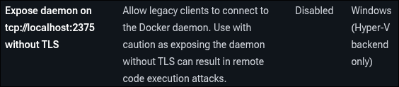

# SimCC 🦠
Simple Command and Control Server  
**⚠️ This software is merely a prove-of-concept and should only be used for education purposes ⚠️**

## Running
First of all, copy `./backend/.env.template` to `./backend/.env` and set your passwords and so on.  

Second of all, `make` is required to run this project.
On linux, install it with your package-manager if not already.
On windows, you can get it [here]('https://gnuwin32.sourceforge.net/packages/make.htm') or from [choco](https://community.chocolatey.org/packages/make).

After that, run it like this:
```
make up
```
### WINDOWS ONLY
Since both the backend itself and out reverse-proxy [traefik](https://hub.docker.com/_/traefik/) must communicate with docker, running it on windows is slightly different.
First, enable the tcp-passthorugh to the docker-daemon in Docker Desktop like explained [here](https://docs.docker.com/desktop/settings-and-maintenance/settings/).
  
TL;DR, use wsl with Docker Desktop like explained [here](https://docs.docker.com/desktop/features/wsl/).

### URLs
- 📝 PGAdmin: [http://localhost:7777/pgadmin](http://localhost:7777/pgadmin)
- 📝 Redis-Insight: [http://localhost:7777/redis](http://localhost:7777/redis)
- 🖼️ Frontend: [http://localhost:7777/](http://localhost:7777/)
- ⚙️ Backend: [http://localhost:7777/api/](http://localhost:7777/api/)
